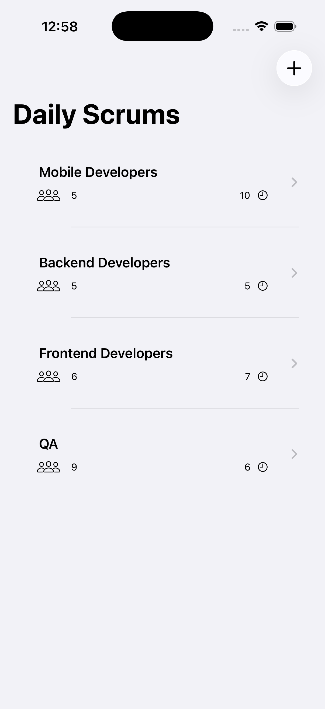
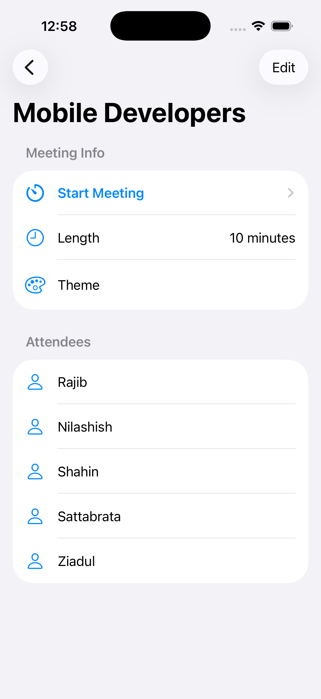
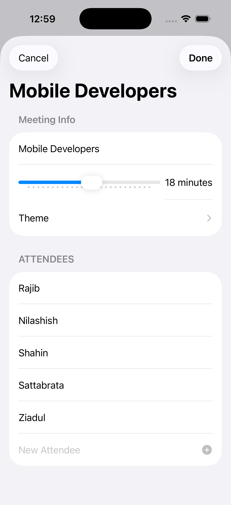
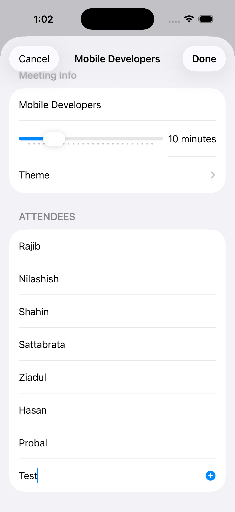

# 📱 Scrumdinger iOS App

Scrumdinger is a SwiftUI‑based iOS app that helps agile teams organize and run their **daily scrums**.  
It provides a clean interface for scheduling meetings, tracking attendees, and managing themes.

---

## ✨ Features

- **[Daily Scrum Dashboard](ca://s?q=Explain_Daily_Scrum_Dashboard)**  
  View all team scrums in one place. Each entry shows:
  - Team name (e.g., Mobile Developers, Backend Developers, QA)
  - Number of participants 👥
  - Meeting duration ⏰

- **[Meeting Details](ca://s?q=Explain_Meeting_Details_in_Scrumdinger)**  
  Tap into a team to see:
  - Meeting length (adjustable via slider)
  - Theme selection
  - Attendee list with names

- **[Attendee Management](ca://s?q=Explain_Attendee_Management_in_Scrumdinger)**  
  Add or remove attendees easily with the **➕ New Attendee** option.

- **Quick Actions**  
  - Start meetings directly from the app
  - Cancel or confirm changes with intuitive buttons
  - Add new scrums with the **➕ button** on the dashboard

---

## 📸 Screenshots

  
  

  
  

---

## 🛠️ Tech Stack

- **SwiftUI** for modern declarative UI
- **Asset Catalog** for managing themes and colors
- **MVVM architecture** for clean separation of concerns

---
